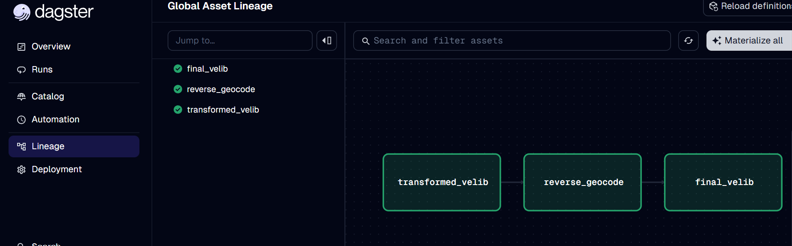

# disponibilite_velib_etl

## Overview

The pipeline extracts Vélib station data from the Paris Open Data platform, applies several transformations and enrichments, and produces a cleaned and structured dataset ready for analysis or storage.

The main goals of this project are:
- Apply good Data Engineering practices
- Work with real-world open data
- Explore orchestration tools (Dagster)
- Optimize performance and resource usage

### Data Source

The dataset is a csv file and it comes from Paris Open Data:
- Source: Vélib - Vélos et bornes - Disponibilité temps réel
- Content: identifiers, station name, geographic coordinates, bike availability, status, and timestamps

### Stack

- **Python 3.12**
- **Dagster** (data orchestration)
- **Pandas** (data processing)
- **OpenCage API** (reverse geocoding)
- **concurrent.futures** (multithreading)

### Architecture

The ETL is organized as a set of Dagster assets:
- `transformed_velib`: Rename columns and standardize naming, Convert data types, Clean unused or empty columns, Add derived columns, Optimize memory usage
- `reverse_geocode`: Reverse geocode geographic coordinates into human-readable addresses using OpenCage API, Use caching and multithreading to reduce execution time
- `final_velib`: Save the final dataset as a cleaned DuckDb file

### Key Features

- Asset-based orchestration with Dagster
- Reverse geocoding with API optimization (cache + multithreading)
- Memory optimization through data type conversion
- Modular and readable pipeline design
- Environment variable management for API keys
- Reproducible and restartable pipeline


## Getting started

### Installing dependencies

**Option 1: uv**

Ensure [`uv`](https://docs.astral.sh/uv/) is installed following their [official documentation](https://docs.astral.sh/uv/getting-started/installation/).

Create a virtual environment, and install the required dependencies using _sync_:

```bash
uv sync
```

Then, activate the virtual environment:

| OS | Command |
| --- | --- |
| MacOS | ```source .venv/bin/activate``` |
| Windows | ```.venv\Scripts\activate``` |

**Option 2: pip**

Install the python dependencies with [pip](https://pypi.org/project/pip/):

```bash
python3 -m venv .venv
```

Then activate the virtual environment:

| OS | Command |
| --- | --- |
| MacOS | ```source .venv/bin/activate``` |
| Windows | ```.venv\Scripts\activate``` |

Install the required dependencies:

```bash
pip install -e ".[dev]"
```

### Run the Project

Create a `env` file with your OpenCage API key:
```
OPENCAGE_API_KEY=<your-api-key>
```

Start the Dagster UI web server:

```bash
dg dev
```

Open http://localhost:3000 in your browser to see the project.

### Materialized assets



### Future Improvements
- Add data quality with asset checks
- Add data visualization